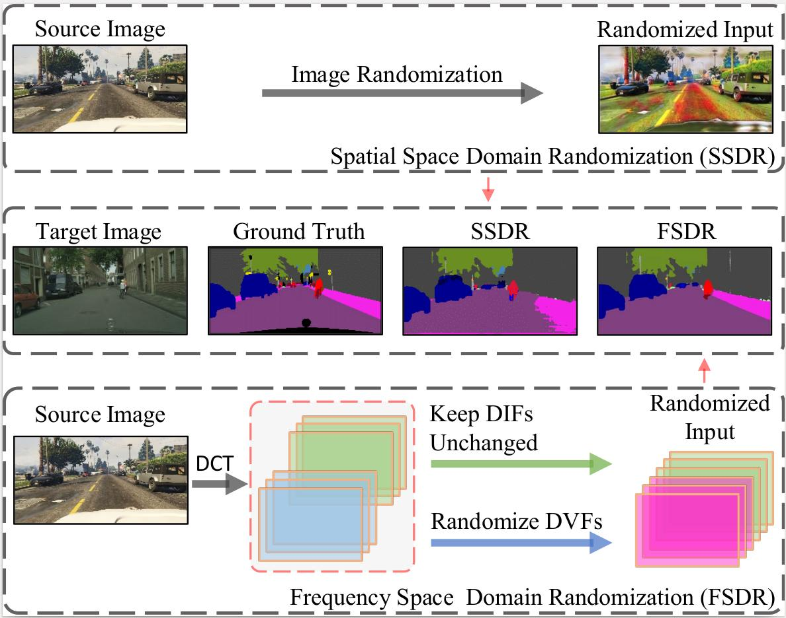

# FSDR: Frequency Space Domain Randomization for Domain Generalization

## Updates
- *06/2021*: check out our domain adaptation for panoptic segmentation paper [Cross-View Regularization for Domain Adaptive Panoptic Segmentation](https://arxiv.org/abs/2103.02584) (accepted to CVPR 2021). Inspired by the idea of JPEG that converts spatial images into multiple frequency components (FCs), we propose Frequency Space Domain Randomization (FSDR) that randomizes images in frequency space by keeping domain-invariant FCs (DIFs) and randomizing domain-variant FCs (DVFs) only. [Pytorch code and pre-trained models are avaliable](https://github.com/jxhuang0508/CVRN).
- *06/2021*: check out our domain adapation for sematic segmentation paper [Scale variance minimization for unsupervised domain adaptation in image segmentation](https://www.researchgate.net/publication/347421562_Scale_variance_minimization_for_unsupervised_domain_adaptation_in_image_segmentation)(accepted to Pattern Recognition 2021). We design a scale variance minimization (SVMin) method by enforcing the intra-image semantic structure consistency in the target domain. [Code avaliable](https://github.com/Dayan-Guan/SVMin).
- *06/2021*: check out our domain adapation for object detection paper [Uncertainty-Aware Unsupervised Domain Adaptation in Object Detection](https://arxiv.org/abs/2103.00236) (accepted to IEEE TMM 2021). We design a uncertainty-aware domain adaptation network (UaDAN) that introduces conditional adversarial learning to align well-aligned and poorly-aligned samples separately in different manners. [Code avaliable](https://github.com/Dayan-Guan/UaDAN).

## Paper


[FSDR: Frequency Space Domain Randomization for Domain Generalization](https://arxiv.org/abs/2103.02370)  
 [Jiaxing Huang](https://scholar.google.com/citations?user=czirNcwAAAAJ&hl=en&oi=ao),  [Dayan Guan](https://scholar.google.com/citations?user=9jp9QAsAAAAJ&hl=en), [Xiao Aoran](https://scholar.google.com/citations?user=yGKsEpAAAAAJ&hl=en), [Shijian Lu](https://scholar.google.com/citations?user=uYmK-A0AAAAJ&hl=en)  
 School of Computer Science Engineering, Nanyang Technological University, Singapore  
 IEEE Conference on Computer Vision and Pattern Recognition (CVPR), 2021

If you find this code useful for your research, please cite our [paper](https://openaccess.thecvf.com/content/CVPR2021/papers/Huang_FSDR_Frequency_Space_Domain_Randomization_for_Domain_Generalization_CVPR_2021_paper.pdf):

```
@InProceedings{Huang_2021_CVPR,
    author    = {Huang, Jiaxing and Guan, Dayan and Xiao, Aoran and Lu, Shijian},
    title     = {FSDR: Frequency Space Domain Randomization for Domain Generalization},
    booktitle = {Proceedings of the IEEE/CVF Conference on Computer Vision and Pattern Recognition (CVPR)},
    month     = {June},
    year      = {2021},
    pages     = {6891-6902}
}
```

## Abstract
Domain generalization aims to learn a generalizable model from a 'known’ source domain for various 'unknown’ target domains. It has been studied widely by domain randomization that transfers source images to different styles in spatial space for learning domain-agnostic features. However, most existing randomization methods use GANs that often lack of controls and even alter semantic structures of images undesirably. Inspired by the idea of JPEG that converts spatial images into multiple frequency components (FCs), we propose Frequency Space Domain Randomization (FSDR) that randomizes images in frequency space by keeping domain-invariant FCs (DIFs) and randomizing domain-variant FCs (DVFs) only. FSDR has two unique features: 1) it decomposes images into DIFs and DVFs which allows explicit access and manipulation of them and more controllable randomization; 2) it has minimal effects on semantic structures of images and domain-invariant features. We examined domain variance and invariance property of FCs statistically and designed a network that can identify and fuse DIFs and DVFs dynamically through iterative learning. Extensive experiments over multiple domain generalizable segmentation tasks show that FSDR achieves superior segmentation and its performance is even on par with domain adaptation methods that access target data in training.

## Preparation

### Pre-requisites
* Python 3.7
* Pytorch >= 0.4.1
* CUDA 9.0 or higher

### Install FSDR
0. Clone the repo:
```bash
$ git clone https://github.com/jxhuang0508/FSDR.git
$ cd FSDR
```

1. Clone ADVENT:
```bash
$ git https://github.com/valeoai/ADVENT.git
```

2. Initialization:
```bash
$ cd ADVENT
$ conda install -c menpo opencv
$ pip install -e <root_dir_of_ADVENT>
$ 
```
You can also take a look at the [ADVENT](https://github.com/valeoai/ADVENT) if you are uncertain about steps to install ADVENT project and environment.

### Datasets
Similar to ADVENT, the datasets are put in ```FSDR/ADVENT/data```.

* **Cityscapes**: You can follow the guidelines in [Cityscape](https://www.cityscapes-dataset.com/) to download the validation images and ground-truths. The Cityscapes dataset directory is supposed to have the following structure:
```bash
FSDR/ADVENT/data/Cityscapes/                         % Cityscapes dataset root              
FSDR/ADVENT/data/Cityscapes/leftImg8bit/val          % Cityscapes validation images
FSDR/ADVENT/data/Cityscapes/gtFine/val               % Cityscapes validation ground-truths
...
```

### Prepare FSDR
```bash
$ cd ..
$ cp fsdr/domain_adaptation/* ADVENT/advent/domain_adaptation
$ cp fsdr/model/* ADVENT/advent/model
$ cp fsdr/script/test_city_fcn.py ADVENT/advent/script
$ cp fsdr/script/configs/* ADVENT/advent/script/configs
```

### Pre-trained models
Pre-trained models can be downloaded [here](https://github.com/jxhuang0508/FSDR/releases/tag/Latest) and put in ```FSDR/ADVENT/pretrained_models```

### Evaluation
```bash
$ cd FSDR/ADVENT/advent/scripts
$ python test.py --cfg ./configs/fsdr_pretrained.yml
$ Evaluating model /home/jiaxinghuang/ADVENT/experiments/snapshots/GTA2Cityscapes_DeepLabv2_MinEnt/model_50.pth
$  20%|███████████████████▊                                                                               | 100/500 [00:33<02:04,  3.21it/s]100 / 500: 44.26
$  40%|███████████████████████████████████████▌                                                           | 200/500 [01:04<01:35,  3.13it/s]200 / 500: 43.10
$  60%|███████████████████████████████████████████████████████████▍                                       | 300/500 [01:36<01:02,  3.18it/s]300 / 500: 43.56
$  80%|███████████████████████████████████████████████████████████████████████████████▏                   | 400/500 [02:08<00:31,  3.18it/s]400 / 500: 44.04
$ 100%|███████████████████████████████████████████████████████████████████████████████████████████████████| 500/500 [02:40<00:00,  3.11it/s]
$	Current mIoU: 44.75
$	Current best model: /home/jiaxinghuang/ADVENT/experiments/snapshots/GTA2Cityscapes_DeepLabv2_MinEnt/model_50.pth
$	Current best mIoU: 44.75
$ road	91.8
$ sidewalk	48.3
$ building	81.99
$ wall	32.49
$ fence	20.69
$ pole	37.28
$ light	37.66
$ sign	26.2
$ vegetation	83.65
$ terrain	38.98
$ sky	60.98
$ person	60.91
$ rider	26.91
$ car	81.54
$ truck	36.89
$ bus	41.58
$ train	0.52
$ motocycle	15.43
$ bicycle	26.46
```

```bash
$ cd FSDR/ADVENT/advent/scripts
$ python test_fcn.py --cfg ./configs/fsdr_pretrained_fcn.yml
$ Evaluating model /home/jiaxinghuang/ADVENT/experiments/snapshots/GTA2Cityscapes_FCN_fsdr_fcn2/model_200.pth
$  20%|████████▏                                | 100/500 [00:34<02:18,  2.89it/s]100 / 500: 45.66
$  40%|████████████████▍                        | 200/500 [01:08<01:39,  3.00it/s]200 / 500: 44.50
$  60%|████████████████████████▌                | 300/500 [01:40<01:01,  3.23it/s]300 / 500: 44.48
$  80%|████████████████████████████████▊        | 400/500 [02:11<00:30,  3.23it/s]400 / 500: 44.18
$ 100%|█████████████████████████████████████████| 500/500 [02:41<00:00,  3.09it/s]
$ 	Current mIoU: 44.86
$ 	Current best model: /home/jiaxinghuang/ADVENT/experiments/snapshots/GTA2Cityscapes_FCN_fsdr_fcn2/model_200.pth
$ 	Current best mIoU: 44.86
$ road	92.07
$ sidewalk	52.6
$ building	82.33
$ wall	26.51
$ fence	27.1
$ pole	35.85
$ light	35.67
$ sign	39.75
$ vegetation	85.33
$ terrain	42.53
$ sky	72.22
$ person	60.24
$ rider	20.95
$ car	84.43
$ truck	33.23
$ bus	36.33
$ train	0.5
$ motocycle	10.04
$ bicycle	14.73
```

## Acknowledgements
This codebase is heavily borrowed from [ADVENT](https://github.com/valeoai/ADVENT) and [AdaptSegNet](https://github.com/wasidennis/AdaptSegNet).

## Contact
If you have any questions, please contact: jiaxing.huang@ntu.edu.sg
